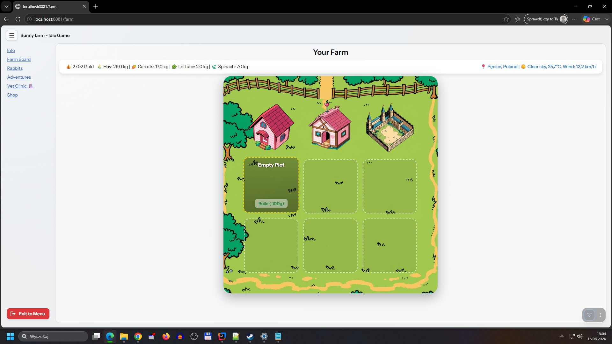
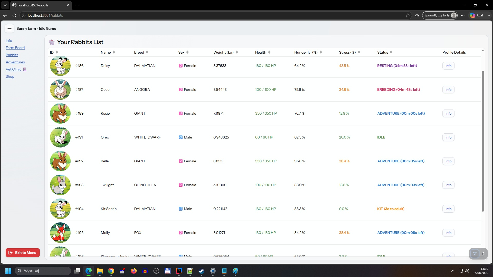
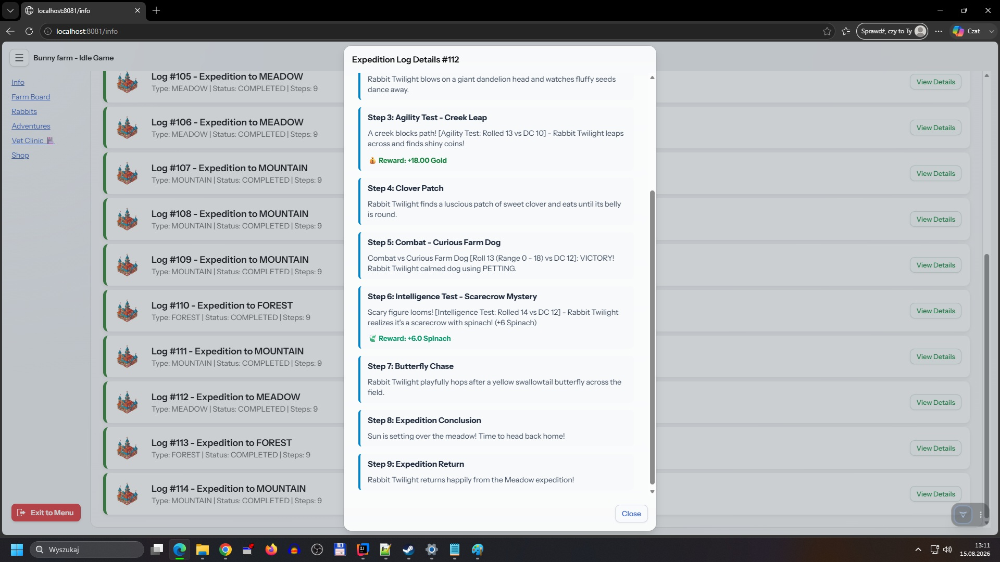
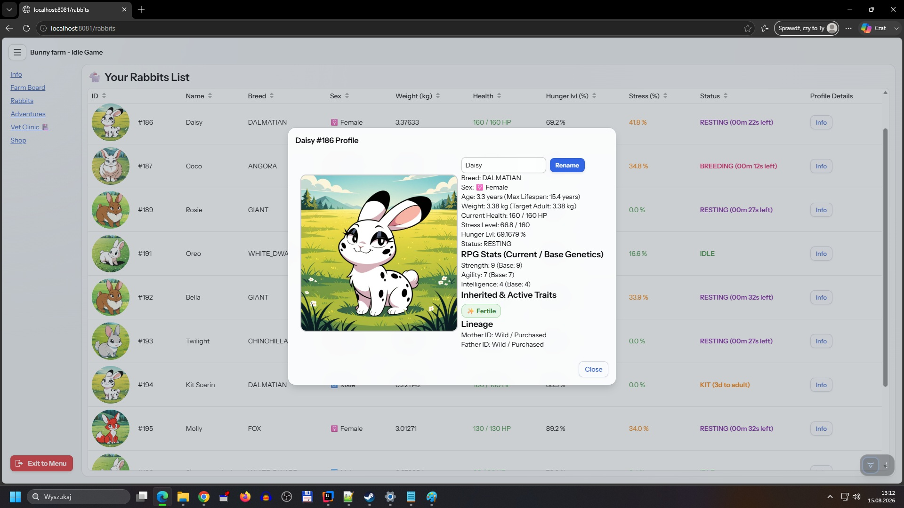

# **Bungenics \- Vaadin Frontend**

User Interface (Frontend) application for the **Bungenics** idle clicker and rabbit breeding simulator. Built with **Vaadin**, it provides an interactive web UI that communicates directly with the Spring Boot REST API backend.

##  Related Repositories

* **Backend (REST API \- Spring Boot):** [https://github.com/Ra-Ger/Bungenics-B](https://github.com/Ra-Ger/Bungenics-B)  
* **Frontend Repository:** [https://github.com/Ra-Ger/Bungenics-F](https://github.com/Ra-Ger/Bungenics-F)

## Quick Start Guide

### **Prerequisites**

1. **Java Development Kit (JDK) 21**  
2. Running **Backend REST API** instance (listening on http://localhost:8080).

### **Step 1: Clone Repository**

git clone https://github.com/Ra-Ger/Bungenics-F.git  
cd Bungenics-F

### **Step 2: Run Application**

#### **Windows (PowerShell):**

.\\gradlew.bat bootRun

#### **Linux / macOS:**

./gradlew bootRun

### **Step 3: Open in Browser**

Open your web browser and go to:

http://localhost:8081  

# **🐇 Bungenics - Rabbit Farm & Adventure**

**Bungenics** is an advanced rabbit farming simulator featuring elements of economy, adventure, genetics, and farm management. Run your own rabbit farm, buy and sell animals, send them on adventures, train, heal, and breed them—all within a dynamic living world featuring real-world weather data and agricultural commodity prices.

##  Breeds & Genetics

There are 9 distinct rabbit breeds in the game, each with unique statistics:

| Breed | Adult Mass | Lifespan | Max Stress | Strength | Agility | Intelligence |
| :---- | :---- | :---- | :---- | :---- | :---- | :---- |
| **WHITE\_DWARF** | 0.5–1.13 kg | 80 | 60 | 2 | 12 | 4 |
| **LIONHEAD** | 1.36–1.70 kg | 220 | 100 | 5 | 6 | 3 |
| **FUZZY\_LOP** | 1.60–1.80 kg | 150 | 110 | 4 | 7 | 2 |
| **ANGORA** | 2.0–5.5 kg | 130 | 100 | 5 | 3 | 12 |
| **FOX** | 2.5–3.2 kg | 140 | 130 | 6 | 9 | 5 |
| **DALMATIAN** | 2.7–3.6 kg | 160 | 160 | 8 | 6 | 3 |
| **HARLEQUIN** | 2.7–3.6 kg | 90 | 120 | 4 | 9 | 8 |
| **CHINCHILLA** | 4.5–7.3 kg | 130 | 190 | 12 | 6 | 3 |
| **GIANT** | 6.4–11.3 kg | 140 | 350 | 8 | 2 | 5 |

### **Rabbit Traits**

Every rabbit can possess genetic traits that directly impact gameplay:

* **Positive Traits:**
    * HARDY – Takes 20% less damage in combat.
    * QUICK\_GROWER – Matures 50% faster.
    * LUCKY – Finds 10% more loot from adventures.
    * CALM – Stress increases 20% slower.
    * FERTILE – 25% chance of twins during breeding.
* **Negative Traits:**
    * GLUTTON – Consumes 20% more food.
    * FRAGILE – Takes 20% greater damage.
    * SKITTISH – Stress increases 20% faster.
    * LAZY – Completes tasks 20% slower.
    * WEAK\_GENES – 20% chance to pass an extra negative trait to offspring.

## Farm & Buildings

Your farm consists of structures, and each structure contains rooms with specific capacities.

* **Structure Types:**
    * WARREN – Rabbit burrow; regenerates health and reduces stress.
    * PLAYHOUSE – Play area; rapidly reduces stress (for stressed rabbits).
    * TRAINING\_GROUND – Training facility; improves stats.
    * TRYSTHOUSE – Breeding house; enables reproduction.

You can build new structures, add rooms, and expand their capacities. Rabbits can be manually assigned to rooms or managed via automatic allocation.

## Economy & Shop

* **Food Supplies:** Hay, Carrots, Lettuce, and Spinach.
* **Dynamic Pricing:** The game fetches real-world agricultural commodity prices from the USDA NASS API, falling back to default values if unavailable.
* **Market Mechanics:** Buy rabbits from the market, sell your own, or purchase food. A rabbit's market valuation depends dynamically on its weight and health status. The market automatically restocks up to 3 random rabbits.

## Adventures

Send your rabbits on expeditions into three distinct locations:

* **FOREST**
* **MEADOW**
* **MOUNTAIN**

**Adventure Mechanics:**

* Weather conditions are fetched live from **Open-Meteo**.
* Skill checks test specific attributes (Strength, Agility, Intelligence).
* Combat encounters feature regular and critical victories/defeats.
* Rewards include gold, carrots, lettuce, and spinach.
* *Warning:* If a rabbit's life drops to zero during an adventure, it will perish.

## Vet & Care

* Send sick or stressed rabbits to the veterinarian to heal and reduce stress.
* Treatment costs scale based on missing health.
* Visits take a few minutes, after which the rabbit returns fully recovered.

## Training

Training at the TRAINING\_GROUND boosts Strength, Agility, or Intelligence. You can boost training efficiency by feeding rabbits specific crops:

* **Spinach** – \+2 Strength
* **Carrot** – \+2 Agility
* **Lettuce** – \+2 Intelligence
* Training costs increase progressively with the rabbit's current stats.

## Breeding

* Breeding takes place in the TRYSTHOUSE.
* Requires at least one adult female and one adult male.
* **Inbreeding Prevention:** Related rabbits cannot breed.
* Offspring inherit breed, stats, and traits from parents with randomized variations.
* The FERTILE trait grants a 25% chance of twins, while WEAK\_GENES risks passing down negative traits.

## Living World - Scheduler Tick (Every 5 Seconds)

The game features an active scheduler that processes the world state every 5 seconds (configurable):

* Rabbits age and mature over time.
* Hunger drops; hungry rabbits feed on hay.
* Rabbits without food starve and lose health.
* Stress increases for homeless rabbits and decreases inside warrens and playhouses.
* Rabbits can die from starvation, extreme stress, or old age.
* Resting, veterinary care, training, and breeding tasks complete automatically upon timer expiration.
* Adventures are fully resolved at the end of ticks.

## How to Get Started

1. Create your farm and purchase your first rabbits from the market.
2. Build a WARREN so they have a place to live.
3. Keep them fed with hay and maintain low stress levels.
4. Train them to boost their attributes.
5. Send them on adventures to gather gold and supplies.
6. Breed your finest specimens to expand your lineage\!

Some screenshots:

